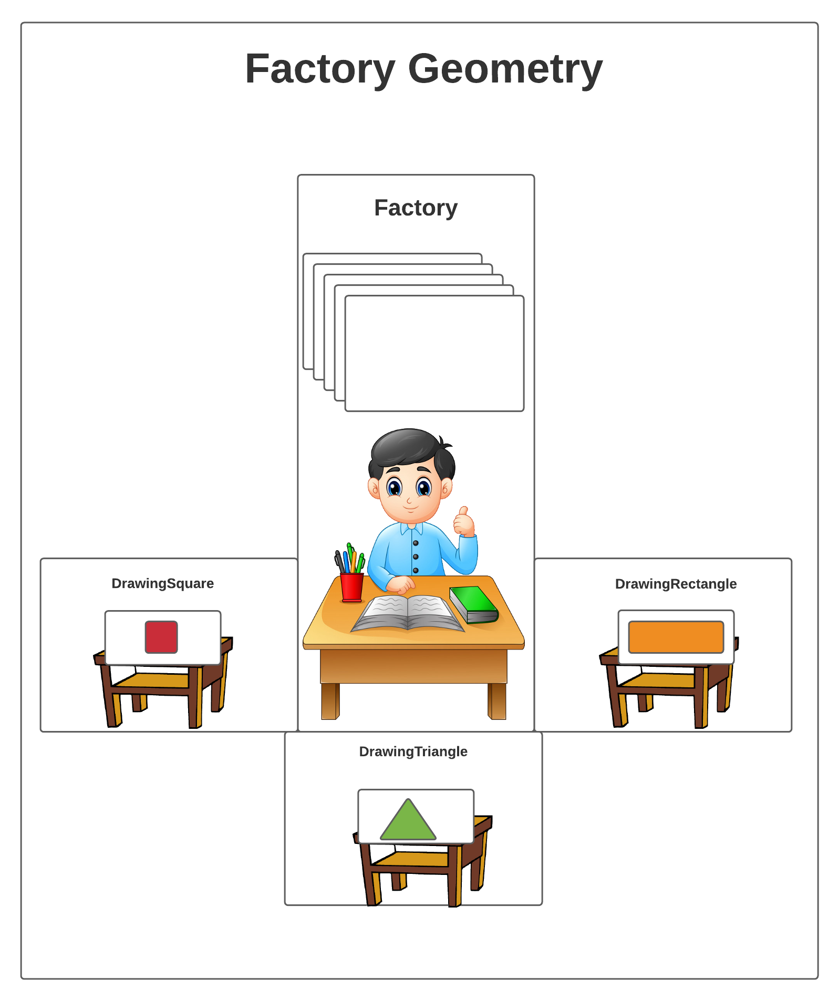
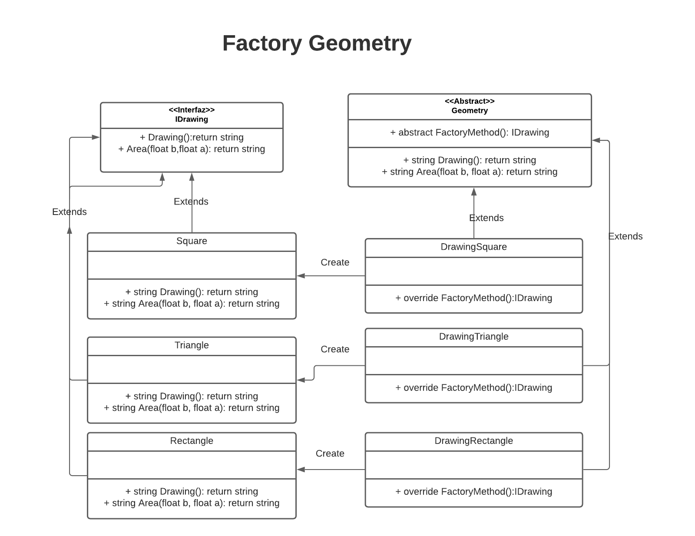

# FactoryGeometry

Elabore un patrón de diseño basado en el creacional Factory Method , donde contamos con una fábrica de figuras geométricas y debemos de concretar tipos:

- Cuadrado
- Rectángulo
- Triangulo

A las 3 figuras geométricas se les puede calcular el área; por lo tanto, debemos de poderlo hacer con la misma firma y método.

# Se solicita:
- Diagrama a su criterio con dibujos naturales del proceso.
- Diagrama de clases.
- Pseudocodigo o código de fuente de un lenguaje de su preferencia (puntos extras).
  - Entregar el código o pseudocodigo en un repositorio público en github (adjunte url)

## diagrama natural

## diagrama de clase

